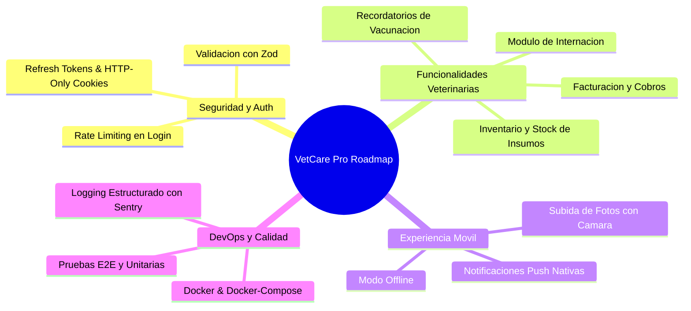

# Roadmap de Posibles Mejoras y Expansiones — VetCare Pro 🚀

Este documento contiene un catálogo estructurado y priorizado de oportunidades de mejora, nuevas características y optimizaciones arquitectónicas para llevar la plataforma **VetCare Pro** a un nivel enterprise de producción.

---

## 🎯 Categorización de Mejoras

---

## 🔴 1. Prioridad Alta (Seguridad & Calidad Base)

| # | Mejora propuesta | Descripción | Impacto | Esfuerzo |
|---|---|---|---|---|
| **1.1** | **Rotación de Refresh Tokens y Cookies HTTP-Only** | Reemplazar el almacenamiento plano de JWT en `localStorage`/`AsyncStorage` por Refresh Tokens en cookies seguras HTTP-Only y tokens de acceso de corta duración (15 min). | 🛡️ Alto (Evita robos XSS) | ⏱️ Medio |
| **1.2** | **Protección Rate-Limiting & Anti Fuerza Bruta** | Agregar `express-rate-limit` en `/api/login` y `/api/register` para limitar a un máximo de 5 intentos fallidos por minuto por dirección IP. | 🛡️ Alto (Evita ataques masivos) | ⏱️ Bajo |
| **1.3** | **Validación Estricta de Esquemas con Zod** | Reemplazar las validaciones con bloques `if` manuales en el backend por esquemas de validación con Zod o Joi en cada endpoint de Express. | 🛡️ Alto (Previene datos corruptos) | ⏱️ Medio |
| **1.4** | **Pruebas Automatizadas Integradas (Jest + Supertest)** | Agregar suite de tests de integración para probar automáticamente el registro, login y reservas de turnos sin intervención manual. | 🧪 Alto (Previene regresiones) | ⏱️ Medio |

---

## 🟡 2. Prioridad Media (Funcionalidades de Negocio & UX)

| # | Mejora propuesta | Descripción | Impacto | Esfuerzo |
|---|---|---|---|---|
| **2.1** | **Módulo de Notificaciones & Recordatorios de Vacunas** | Envió de alertas automáticas (Email / WhatsApp / Push) 48hs antes de cada turno o cuando expira una vacuna anual. | 📲 Alto (Fidelización de clientes) | ⏱️ Medio |
| **2.2** | **Carga de Fotos Reales de Mascotas (Expo Image Picker + Cloudinary / S3)** | Integración con la cámara del celular y almacenamiento en la nube para adjuntar fotos de pacientes y avatares de usuario. | 🎨 Medio (Mejora estética UI) | ⏱️ Bajo |
| **2.3** | **Facturación y Punto de Venta (POS / Registro de Cobros)** | Registro de pagos (Efectivo, Tarjeta, MercadoPago), emisión de comprobantes y reporte de caja diario/mensual para la veterinaria. | 💰 Alto (Gestión financiera) | ⏱️ Alto |
| **2.4** | **Inventario y Control de Stock de Medicamentos** | Catálogo de insumos médicos con descuento automático al prescribir en consulta y alerta de bajo stock. | 📦 Alto (Control operativo) | ⏱️ Medio |

---

## 🟢 3. Prioridad Futura / Expansión (Escalabilidad & Enterprise)

| # | Mejora propuesta | Descripción | Impacto | Esfuerzo |
|---|---|---|---|---|
| **3.1** | **Notificaciones Push Nativas con Expo Notifications** | Notificaciones push nativas al dispositivo móvil del dueño cuando el veterinario confirma un turno o emite una receta. | 🔔 Alto (Experiencia móvil) | ⏱️ Medio |
| **3.2** | **Módulo de Internación / Pacientes Hospitalizados** | Hoja de evolución clínica diaria para pacientes internados con gráfico de constante de signos vitales (T°, Frecuencia cardíaca, hidratación). | 🏥 Alto (Veterinarias grandes) | ⏱️ Alto |
| **3.3** | **Modo Offline Móvil (WatermelonDB / SQLite)** | Permitir al veterinario consultar e ingresar historias clínicas sin conexión a internet, sincronizando automáticamente al reconectarse. | 🌐 Medio (Uso en zonas rurales) | ⏱️ Alto |
| **3.4** | **Dockerización y Despliegue CI/CD (`docker-compose.yml`)** | Empaquetar backend, frontend, app y base de datos MongoDB en contenedores Docker con pipeline automatizado en GitHub Actions. | 🐳 Alto (Despliegue ágil) | ⏱️ Medio |

---

## 📌 Recomendación de Próximos Pasos

Si se desea continuar enriqueciendo el proyecto, se recomienda avanzar en el siguiente orden sugerido:

1. **Implementación de Subida de Fotos con Cámara en la App Móvil** (`Expo Image Picker`).
2. **Sistema de Alertas / Recordatorios de Vacunación y Turnos**.
3. **Módulo de Control de Stock e Insumos Médicos**.
